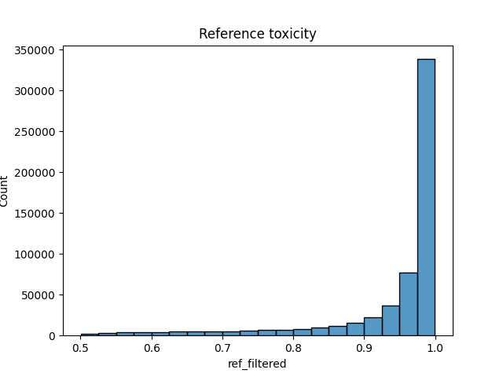
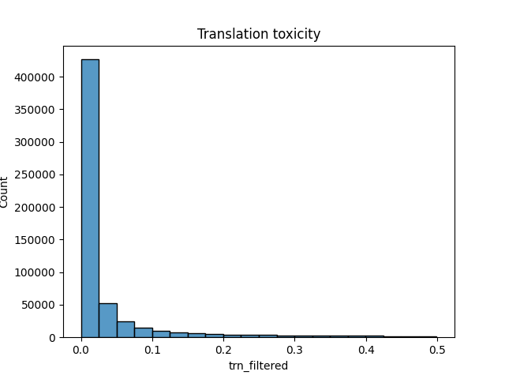

# Final Solution Report

## Introduction

The text detoxification is a active area of research, and does not have firmly established state-of-the art model architectures. The detoxification task can be tricky because it requires both the preservation of the meaning of the sentence, while still changing the style, which may be mutually exclusive tasks. Thus, any model for such a task needs to be flexible while having a strong awareness about the meaning of a sentence and a text as a whole.

## Data analysis

The dataset used for this assignment is a filtered subset of the ParaNMT [1] corpus, consisting of 500K sentence pairs. The data is not preprocessed, outside of making sure reference text is less toxic than translation text, which is done at runtime.
The distribution of the data can be seen on figures.

Overall, the distribution has distinct spikes, as expected. More notably, each reference-translation pair lies on different sides of 0.5 toxicity score.

## Model Specification

The final model is a fine-tuned generative pre-trained transformer 2 (GPT-2) model [2]. For this dataset, the small version of the GPT-2 is chosen, having 125M parameters, compared to full-size model boasting 1.5B parameters. However, as GPT-2 by itself is a generational model and not a paraphraser model, modification of the input data is required to accomodate the reference text. To do this, reference and translation text is separated using a special token. To preserve existing tokenizer indicies, existing `<|endoftext|>` token is used as a separation token.

Other notable architectures include fine-tuning or otherwise utilizing a paraphraser model [3, 4], and masking tokens that are deemed offensive [3, 5]. However, paraphrasing models may not be available for all languages and require a supervised dataset, and masked models generally have less parameters when compared to the pure generational models (340M parameters for BERT [6], compared to rumored 1.7 trillion parameters for GPT-4.) However, the bigger number of parameters may also be considered a disadvantage, as it requires more computational resources to run inference.

## Training Process

The GPT model is finetuned on a 10K subset of the main dataset.
During the training, the reference-translation pairs are concatenated using the separation token. This sequence is then tokenized. The loss is then calculated as follows:
$$\mathcal{L} = \sum\limits_{i=1}^{n-1} -\log P(x_{i+1}|x_{1:i})$$
Where $n$ is the length of the tokenized sequence.
The parameters are optimized using an AdamW optimizer, with $\epsilon = 10^{-6}$, $\beta_1 = 0.9$, $\beta_2 = 0.999$. The learning rate is changed according to the linear schedule with warmup of $500$ steps. During the warmup, learning rate changes linearly to $3 \cdot 10^{-5}$, and then linearly decays to zero.

## Evaluation

BLEU is used for evaluation, as one of the most popular metrics used to judge the similarity of metrics, while still being automated. The final model has a BLEU score of approximately 27. Notably, the results are on par with the models discussed in [4], despite the small amount of training done.

## Results

Leveraging pre-trained weights allows to train high-quality models using a relatively small amount of computational resourses. Furthermore, the method proposed is scalable by either using large language models with more parameters (such as the full version of GPT-2) and using a bigger training dataset.

## References

[1] J. Wieting, K. Gimpel, "ParaNMT-50M: Pushing the Limits of Paraphrastic Sentence Embeddings with Millions of Machine Translations," in Proceedings of the 56th Annual Meeting of the Association for Computational Linguistics (Volume 1: Long Papers), 2018, pp. 451–462.

[2] Radford, A., et al. "Language models are unsupervised multitask learners," in OpenAI blog, vol. 1, no. 8, pp. 9, 2019.

[3] David Dale, Daryna Dementieva, et al. "Text Detoxification using Large Pre-trained Neural Models," in CoRR, vol. abs/2109.08914, 2021.

[4] Laugier, L., et al. "Civil rephrases of toxic texts with self-supervised transformers," in arXiv preprint arXiv:2102.05456, 2021.

[5] Hallinan, S., et al. "Detoxifying text with marco: Controllable revision with experts and anti-experts," in arXiv preprint arXiv:2212.10543, 2022.

[6] Devlin, J., et al. "Bert: Pre-training of deep bidirectional transformers for language understanding," in arXiv preprint arXiv:1810.04805, 2018.
